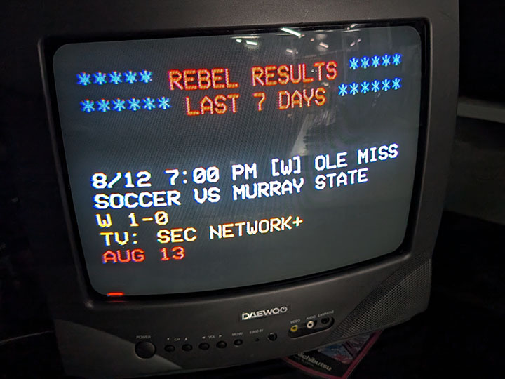
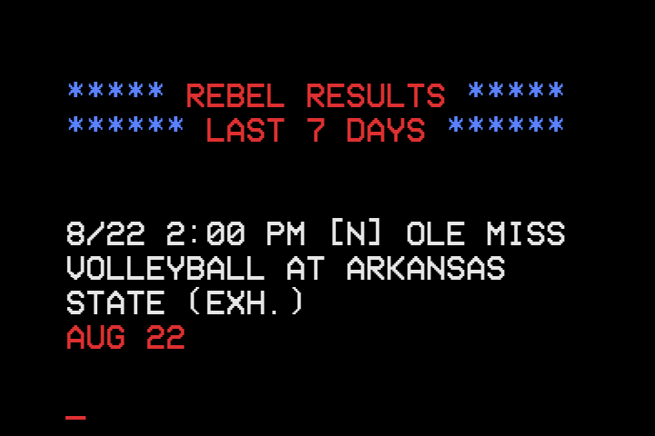

# CHANNEL 38 (`channel38`)

A vintage-style news terminal for a Raspberry Pi + CRT, displaying live
Ole Miss and SEC football updates, college football rankings, and news
headlines over composite video in a TV-typewriter style (mimicking Don
Lancaster's TV Typewriter).



Built for a Raspberry Pi 3B+ running Raspberry Pi OS Bookworm. A heavily
customized fork of [RetroFeed](https://github.com/JeffJetton/retrofeed)
by Jeff Jetton — this version replaces the general news/weather/finance
segments with Ole Miss/SEC-specific content and a full rewrite of the
rendering pipeline.



## Architecture

Renders via headless pygame (`SDL_VIDEODRIVER=dummy`) directly onto
`/dev/fb0`, with keyboard/remote input read via raw `evdev` — the same
architecture as its sibling apps [BARS](https://github.com/LawtonBarnes/bars)
and [LOUDNESS](https://github.com/LawtonBarnes/loudness). Column/row count
and font size are computed from real font metrics against the actual
framebuffer resolution (`display.py`'s `fit_font()`), not hardcoded, so it
self-corrects across different displays. No venv — `pygame`, `evdev`,
`numpy`, `beautifulsoup4`, and `requests` are all system packages.

## Keyboard / remote controls

| Key | Action |
|---|---|
| `↑` / `↓` | Skip forward/backward through the segment playlist |
| `Home` | Jump straight back to the app menu |
| `Q` / `Esc` / `Back` | Quit to the app menu |
| Vol `↑` / `↓` | Toggle the typewriter click sound on/off |

## Segments

Ole Miss football results/schedule, SEC football roundup, Pete Golding
news, CFB rankings, AP Top 25, AP News, ESPN College Football, NYT News,
current conditions, date/time, and Ole Miss/Channel 38 ASCII art. Segment
order, timing, and which are active are controlled via `config.toml` —
see `segments/` for individual modules, each following the pattern in
`segments/template.py`.

## Requirements

- Internet access (every segment pulls live data over HTTP; there's no
  offline/cached fallback content).
- `pygame`, `evdev`, `numpy`, `beautifulsoup4`, `requests` (system
  packages, no venv).

## Installing on a fresh Pi

1. **Install dependencies:**
   ```bash
   sudo apt-get install -y python3-pygame python3-evdev python3-numpy python3-bs4 python3-requests
   ```

2. **Copy the files:**
   ```bash
   sudo git clone https://github.com/LawtonBarnes/channel38.git /opt/channel38
   ```

3. **Create the launcher:**
   ```bash
   sudo tee /usr/local/bin/channel38 > /dev/null << 'EOF'
   #!/bin/sh
   exec python3 /opt/channel38/channel38.py "$@"
   EOF
   sudo chmod +x /usr/local/bin/channel38 /opt/channel38/channel38.py
   ```

4. **Enable composite video output** (same `vc4-fkms-v3d` requirement as
   [BARS](https://github.com/LawtonBarnes/bars) -- see that repo's README
   for the full config.txt steps).

5. **Set boot to console** and optionally **auto-launch on boot** --
   same steps as BARS's README, substituting `channel38` for `bars`.

6. **Reboot** and confirm the CRT shows the segment rotation.

If you're running this as part of a [McBrain](https://github.com/LawtonBarnes/mcbrain)
fleet instead of standalone, skip steps 3/5 -- install alongside
[STRINGS](https://github.com/LawtonBarnes/strings) and assign it from
[SCRUTE](https://github.com/LawtonBarnes/scrutinizer) instead of a
manual launcher/autologin.

## Credits

- Built on [RetroFeed](https://github.com/JeffJetton/retrofeed) by Jeff Jetton (MIT License — see `LICENSE`)
- Font: `VCR_OSD_MONO_1.001.ttf`

## License

MIT — see `LICENSE`. Original copyright retained per the terms of the upstream RetroFeed project.
